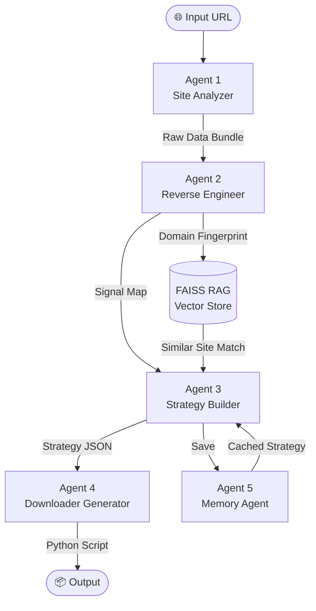

# 🎯 VideoHunter AI — Agent-by-Agent Blueprint

> **Project**: Adaptive Media Extraction Agent  
> **Stack**: Python · Playwright · LangChain · CrewAI/LangGraph · FAISS · SQLite · FastAPI

---

## Architecture Overview



---

## Agent 1 — Site Analyzer

### Role
Opens the target URL using a real browser and collects every observable artifact before any analysis begins.

### Inputs
- Target URL (string)
- Optional: credentials / cookies file

### Tools
| Tool | Purpose |
|------|---------|
| `Playwright` | Primary browser automation (headless + stealth) |
| `Selenium` + `undetected_chromedriver` | Fallback for anti-bot sites |
| `mitmproxy` / Playwright `route()` | Intercept all network traffic |

### Collection Tasks
```
1. Full page HTML (after JS render)
2. DOM snapshot (document.documentElement.outerHTML)
3. All Network Requests:
   - URL, Method, Headers, Response body (if JSON/text)
   - Filter: XHR, Fetch, Media (video/audio/m3u8/mpd)
4. Console logs (page.on("console"))
5. Loaded <script> src URLs + inline script content
6. Cookies & localStorage dump
7. Video/Audio element src attributes
8. <source> tags inside <video>
9. Service Worker registrations
10. Blob URL detections (window.URL.createObjectURL hooks)
```

### Output — Raw Data Bundle (JSON)
```json
{
  "url": "https://example.com/lesson/1",
  "html": "...",
  "dom": "...",
  "network_requests": [...],
  "console_logs": [...],
  "scripts": [...],
  "video_tags": [...],
  "blob_urls": [...],
  "cookies": {...},
  "local_storage": {...}
}
```

### Key Implementation Notes
- Use `page.route("**/*", handler)` to intercept ALL requests before they complete
- Hook `URL.createObjectURL` via `page.add_init_script()` to capture blob URLs at creation time
- Wait for `networkidle` state before collecting to catch lazy-loaded content
- Capture `page.on("response")` for content-type `application/x-mpegURL` and `video/*`

---

## Agent 2 — Reverse Engineering Agent

### Role
Analyzes the raw data bundle to extract signals and build a structured map of how the site delivers video.

### Inputs
- Raw Data Bundle from Agent 1

### Analysis Pipeline

#### Step 1 — Network Pattern Detection
```python
PATTERNS = {
    "m3u8":     r"\.m3u8(\?|$|#)",
    "mpd":      r"\.mpd(\?|$|#)",
    "mp4_api":  r"(video|media|stream|content).*\.mp4",
    "hls_api":  r"(hls|stream|manifest)",
    "token_api": r"(token|auth|sign|key)=",
    "cdn_url":  r"(cdn\.|akamai|cloudfront|fastly)",
}
```

#### Step 2 — JavaScript Static Analysis
- Scan all `<script>` content for:
  - `fetch(`, `axios.get(`, `$.ajax(` → extract URL patterns
  - `video\.src\s*=`, `player\.src(` → direct assignments
  - `.m3u8`, `.mpd`, `blob:` string literals
  - Obfuscated code detection (entropy analysis → flag for LLM)

#### Step 3 — API Endpoint Reconstruction
```
For each intercepted Fetch/XHR:
  - Record: URL template, params, response schema
  - If response contains { url, src, stream, manifest } → HIGH PRIORITY
  - If response is binary → check Content-Type
```

#### Step 4 — Blob URL Tracing
```
If blob:// URLs detected:
  - Trace back to MediaSource API usage
  - Identify segment fetch patterns (chunk_0.ts, seg-1-v1.ts)
  - Map initialization segment
```

### Output — Signal Map (JSON)
```json
{
  "domain": "example.com",
  "signals": {
    "direct_video_tag": false,
    "m3u8_found": true,
    "m3u8_urls": ["https://cdn.example.com/video/master.m3u8?token=xxx"],
    "mpd_found": false,
    "blob_detected": false,
    "api_video_endpoint": "https://api.example.com/v2/lesson/{id}/stream",
    "auth_required": true,
    "auth_headers": {"Authorization": "Bearer ..."},
    "js_obfuscated": false,
    "player_library": "video.js"
  },
  "confidence": 0.87
}
```

---

## Agent 3 — Strategy Builder

### Role
Uses an LLM + RAG system to decide the best extraction strategy based on the Signal Map and knowledge of similar sites.

### Inputs
- Signal Map from Agent 2
- FAISS vector store (past site knowledge)
- SQLite memory from Agent 5

### Decision Flow

```
1. Check Memory Agent cache
   └── If domain exists → return cached strategy (skip LLM)

2. Query FAISS RAG
   └── Embed Signal Map → find top-3 similar domains
   └── Retrieve their successful strategies

3. LLM Reasoning (LangChain / LangGraph)
   └── Prompt: "Given these signals and similar sites, what is the best strategy?"
   └── Output: structured Strategy JSON

4. Validate strategy (dry-run check)
5. Save to Memory Agent
```

### LLM Prompt Template
```
You are a video extraction expert.

Signal Map: {signal_map}

Similar sites and their strategies:
{rag_results}

Choose the best strategy from:
- "direct_url"     → video tag src is public
- "m3u8_ffmpeg"   → HLS stream, use ffmpeg
- "m3u8_ytdlp"    → HLS stream, use yt-dlp
- "mpd_ytdlp"     → DASH stream
- "api_fetch"     → hit API endpoint, extract URL
- "blob_capture"  → capture MediaSource segments
- "ytdlp_generic" → let yt-dlp handle it
- "custom"        → generate custom code

Respond ONLY in JSON:
{
  "strategy": "...",
  "reason": "...",
  "params": {...}
}
```

### Output — Strategy JSON
```json
{
  "domain": "example.com",
  "strategy": "m3u8_ffmpeg",
  "reason": "Master M3U8 found in network with auth token in URL",
  "params": {
    "manifest_url": "https://cdn.example.com/video/master.m3u8?token=xxx",
    "headers": {"Referer": "https://example.com"},
    "auth_in": "query_param"
  },
  "confidence": 0.92,
  "fallback": "ytdlp_generic"
}
```

---

## Agent 4 — Downloader Generator

### Role
Auto-generates a ready-to-run Python download script based on the Strategy JSON.

### Inputs
- Strategy JSON from Agent 3
- Signal Map from Agent 2

### Code Templates by Strategy

#### `direct_url` Template
```python
import requests

url = "{video_url}"
headers = {headers}

r = requests.get(url, headers=headers, stream=True)
with open("output.mp4", "wb") as f:
    for chunk in r.iter_content(chunk_size=8192):
        f.write(chunk)
print("Done!")
```

#### `m3u8_ffmpeg` Template
```python
import subprocess

manifest = "{manifest_url}"
output = "output.mp4"
headers_str = "{headers_as_ffmpeg_flags}"

cmd = [
    "ffmpeg", "-y",
    "-headers", headers_str,
    "-i", manifest,
    "-c", "copy", output
]
subprocess.run(cmd, check=True)
```

#### `api_fetch` Template
```python
import requests

session = requests.Session()
session.headers.update({headers})

# Step 1: Get stream URL from API
api_resp = session.get("{api_endpoint}")
stream_url = api_resp.json()["{url_key}"]

# Step 2: Download
r = session.get(stream_url, stream=True)
with open("output.mp4", "wb") as f:
    for chunk in r.iter_content(8192):
        f.write(chunk)
```

#### `ytdlp_generic` Template
```python
import yt_dlp

ydl_opts = {
    "outtmpl": "output.%(ext)s",
    "http_headers": {headers},
    "cookiefile": "cookies.txt",  # if auth needed
}

with yt_dlp.YoutubeDL(ydl_opts) as ydl:
    ydl.download(["{target_url}"])
```

### Code Generation Process
```
1. Select template based on strategy.strategy
2. Fill in all {placeholders} from strategy.params
3. Add error handling + progress bar (tqdm)
4. Add retry logic (tenacity)
5. Validate syntax (ast.parse)
6. Save to output/{domain}_downloader.py
7. Return script as string + file path
```

### Output
- `output/{domain}_downloader.py` — runnable Python script
- Execution report (success/failure + stdout)

---

## Agent 5 — Memory Agent

### Role
Persistent storage and retrieval system. Prevents re-analysis of known sites and feeds the RAG system.

### Storage Layers

| Layer | Technology | Purpose |
|-------|-----------|---------|
| Site Cache | SQLite | Fast exact-match lookup by domain |
| RAG Index | FAISS + SQLite | Semantic similarity search |
| Script Archive | File System | Saved downloader scripts |

### SQLite Schema
```sql
CREATE TABLE site_memory (
    id          INTEGER PRIMARY KEY,
    domain      TEXT UNIQUE,
    strategy    TEXT,           -- JSON Strategy object
    signal_map  TEXT,           -- JSON Signal Map
    embedding   BLOB,           -- FAISS vector
    success_rate REAL DEFAULT 1.0,
    last_used   TIMESTAMP,
    use_count   INTEGER DEFAULT 1
);

CREATE TABLE extraction_log (
    id          INTEGER PRIMARY KEY,
    domain      TEXT,
    url         TEXT,
    strategy    TEXT,
    success     BOOLEAN,
    error_msg   TEXT,
    timestamp   TIMESTAMP
);
```

### RAG Pipeline
```python
# Save new site
def remember_site(domain, strategy, signal_map):
    text = f"{domain} {signal_map['signals']} {strategy['strategy']}"
    embedding = embed_model.encode(text)
    faiss_index.add(embedding)
    sqlite_db.insert(domain, strategy, signal_map, embedding)

# Retrieve similar sites
def recall_similar(signal_map, top_k=3):
    text = str(signal_map['signals'])
    query_vec = embed_model.encode(text)
    distances, indices = faiss_index.search(query_vec, top_k)
    return [sqlite_db.get_by_index(i) for i in indices[0]]
```

### Memory Update Logic
```
After each extraction attempt:
  - IF success → success_rate = (old_rate * count + 1) / (count + 1)
  - IF failure → try fallback strategy
               → update strategy if fallback worked
               → log failure for analysis
```

---

## Project File Structure

```
VideoHunterAI/
├── agents/
│   ├── site_analyzer.py       # Agent 1
│   ├── reverse_engineer.py    # Agent 2
│   ├── strategy_builder.py    # Agent 3
│   ├── downloader_gen.py      # Agent 4
│   └── memory_agent.py        # Agent 5
├── core/
│   ├── browser.py             # Playwright/Selenium manager
│   ├── network_interceptor.py # Traffic capture
│   ├── llm_client.py          # OpenAI/Gemini wrapper
│   └── rag.py                 # FAISS + embeddings
├── templates/
│   └── downloader_templates/  # Code generation templates
├── memory/
│   ├── sites.db               # SQLite database
│   └── faiss.index            # Vector index
├── output/
│   └── {domain}_downloader.py # Generated scripts
├── api/
│   └── main.py                # FastAPI REST interface
├── config.py
├── requirements.txt
└── README.md
```

---

## FastAPI Endpoints

```
POST /extract          → Run full pipeline for a URL
GET  /memory/{domain}  → Get cached strategy
GET  /similar?url=...  → Find similar sites from RAG
GET  /history          → Extraction log
POST /feedback         → Report success/failure
```

---

## Development Phases

| Phase | Agents | Goal |
|-------|--------|------|
| **Phase 1** | 1 + 2 | Working browser + network capture |
| **Phase 2** | + 3 | LLM strategy selection |
| **Phase 3** | + 4 | Auto code generation |
| **Phase 4** | + 5 | Memory + RAG |
| **Phase 5** | All | FastAPI + UI dashboard |
